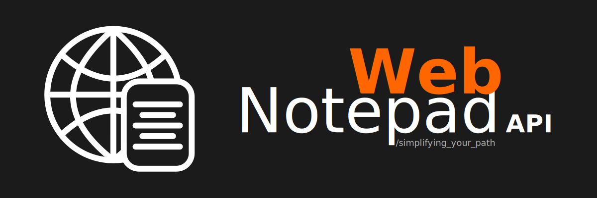

<h1></h1>

## Web Notepad API

This application was made with the purpose to study Back-End, focusing on API and TypeScript.

Currently it's public for people that needs something similar to use.

### Technologies

- Node.js
- Express.js
- TypeScript

### Features

- Directory navigation
- Read files
- Edit file content
- Create files/folders

#### To be implemented

- SSH Access

### Quick-start (Step by Step)

1. Clone this repository to a directory
2. Use the following commands:

- `npm i`
  Install all **Web Notepad API** dependencies.
- `npm start`
  Run application.

3. Open your browser and enter the following URL: `localhost:4000`

> At the moment, application runs on **PORT 4000**, but you can change in `src/index.ts` file.

### License

Copyright © 2022, [Vinícius R. Vieira](https://github.com/viniciusrvieira). Released under the [MIT License](/LICENSE).
